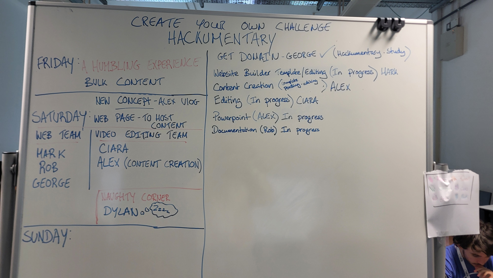

# Hackumentary

## 404 - Idea not found
On day one of our SpaceApps journey we attempted to build a Space Biology Knowledge Engine, hosted on a webpage, utilisng AI that we had trained on Data provided by NASA. Unfortunately, our collective knowledge gaps proved too much to acheive a viable prototype and we have had to pivot into a new challenge.

This has given us a valuable learning experience both in adapting our approach from concept to build and given us an insight into where we can direct future learning. It is however, not a total failure, as we have gained an experience and also, througout our attempt we documented everything, with text, imagery and video, we met many amazing fellow hackers, we collaborated and learned.

## ctrl-alt-pivot
Which leads us to our new challenge, Hackumentary will be a documentary of sorts, hosted on a webpage of our making, will feature our process for our first attempt, testimonials, video interviews both with the team and fellow hackers and imagery.

## astrolife-engine
A web application that leverages AI, knowledge graphs, and/or other tools to summarize the 608 NASA bioscience publications listed in an online repository, and enables users to explore the impacts and results from the experiments those publications describe.

## Index - Table of contents
* [Tasks](#tasks)
* [Reference Links](#reference-links)

## Tasks
# AstroLife Engine

    

### Google Cloud Platform Team: Dylan/Ciara
Enabled APIs
Vertex AI API - To train machine learning modules.
Cloud Storage API - Storing the NASA Repository (.CSV files).
Roadblocks hit. AI learning would not complete, several different changes attempted but utimately beyond our skillset. 

Created Bucket
Downloaded the 608 publication links from the NASA resource repository in .CSV format and added them to the bucket on GCP.

Trained AI Model
Imported the .CSV files from the bucket to Vertex AI and trained the AI model.

### GoDaddy Domain/Website Build Team: Mark/Rob
Chose a .study domain as other options didn’t allow for WHOIS security.
First major roadblacks hit, previously used software no longer available 

### Graph Integration Team: Alex/George
Researching methods for integrating graphs/ taking graph data from repositories.

### Documentation: Rob/Alex

# Hackumentary

    

### Website Build Team: Mark/Rob/Dylan
We chose a .study domain as other options didn’t allow for WHOIS security.
Using VsCode and MongoDB we created our website witha blog and comment function, we added CRUD features so posts could be updated and deleted.

### Media Editing Team: Ciara/Dylan
As the content creation team captured footage and images, they would send this to our editing team via WhatsApp and email. The editing team would then sort through the content to find what best suited our needs and using DaVinci Resolve and ClipChamp would edit the raw footage.

### Content Creation Team: Alex
Using Alex's iPad, we continued to take video of our team throughout our creation process. We also took video of other hackers participating, with their consent and interviewed willing teams and HackAthlone staff and volunteers on site for their perspective and experiences. 

### Documentation: Rob/Alex
Each individual kept a track of their work and links used, Rob then gathered this and kept updating the ReadME file on github. 

## Reference Links
Web Page:

https://www.mongodb.com/products/platform/atlas-database

https://nodejs.org/en

https://www.w3schools.com/mongodb/

https://www.spaceapps.earth/

https://chatgpt.com/

Media Editing:

https://www.blackmagicdesign.com/event/davinciresolvedownload

Documentation:

https://github.com/

